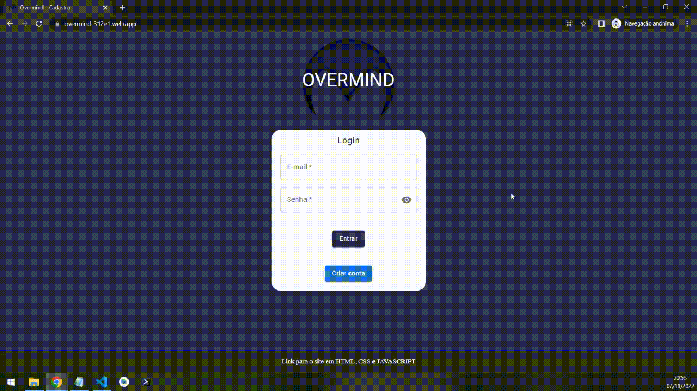
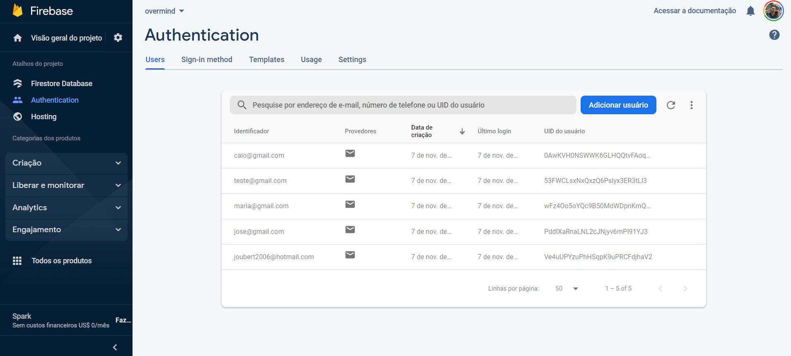
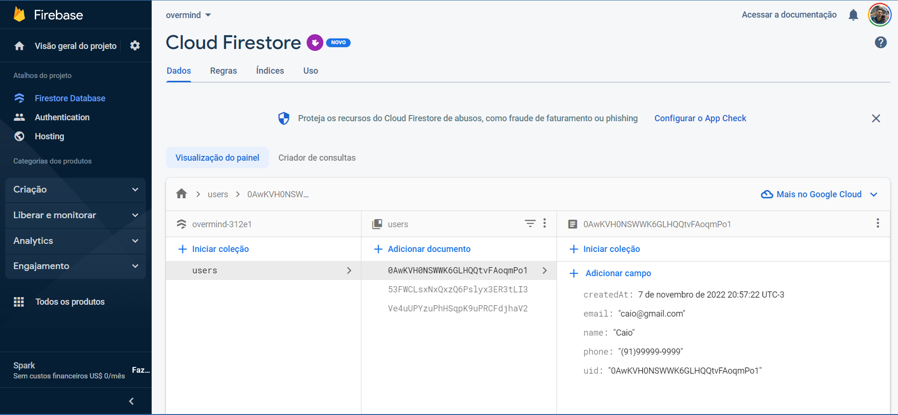
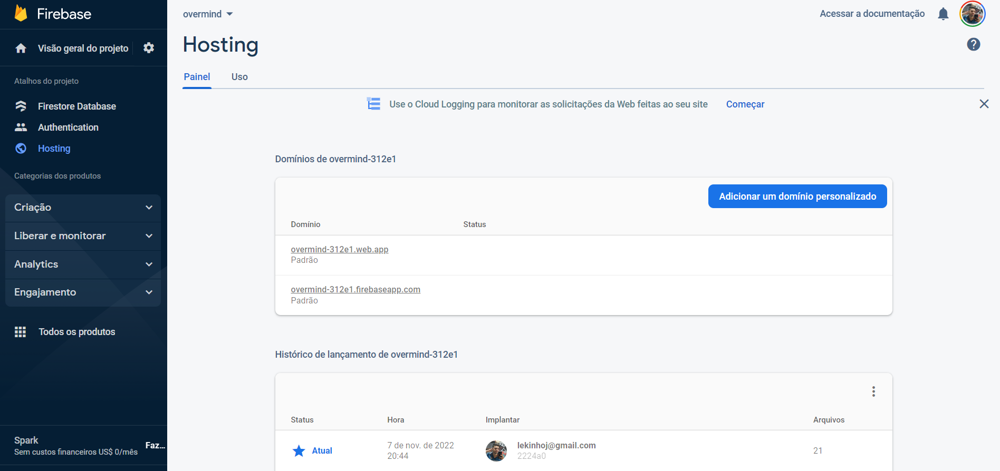

<h1 align="center">OVERMIND</h1>

<h1 align="center">

</h1>

# Link: [URL](https://overmind-312e1.web.app/)

### Funcionalidades


- Login, criação, alteração e remoção de usuários, salvando no localStorage e salvando no banco de dados(Firebase Firestore);
- Logoff removendo os dados do localStorage
- Na tela de exibição dos usuários(tela home) tem um botão de enviar os dados de qualquer usuário para o e-mail solicitado


### Tecnologias

- [React](https://pt-br.reactjs.org/)
- [Firebase](https://firebase.google.com/)
- [Yarn Workspaces](https://classic.yarnpkg.com/en/docs/workspaces/)


### Como usar

```bash
# Clone o repositório
$ git clone git@github.com:alexjou/form-react.git

# Entre na pasta
$ cd form-react

# Instale as dependencias
$ yarn install ou npm install

# Inicie o site
$ yarn start ou npm start
```

###


## DESCRIÇÃO DO TESTE


## 🏗 O que fazer? - Formulário Básico

Este teste consiste em construir um formulário cadastral básico, utilizando qualquer - ou nenhum - framework de frontend, que permita um acesso direto por um arquivo .html e que apresente:

- Nome completo
- Email
- Telefone
- senha e validação de senha
- botão de enviar

Ao clicar em enviar, a página deverá enviar o conteúdo do formulário para caroline-brod@overmind.ai

## 🚨 Requisitos

- O formulário necessariamente precisará ser responsivo. A interação via desktop deverá ser prioritária, mas ele deverá preservar a navegabilidade em smartphones.
- O estilo do formulário é completamente livre, e as escolhas de interação e cores serão também critérios desta avaliação.

Diferenciais:
- possibilidade de alternar entre modo dia (interfaces claras) e modo noite (interfaces escuras)
- interações animadas em focus, hover e quaisquer outras que julgar pertinentes à proposta
- popup de confirmação após clicar em enviar

## 🕵🏻‍♂️ Itens a serem avaliados

✔️  Organização do código (independente da tecnologia utilizada)
✔️  Limpeza
✔️  Facilidade de entendimento.

## Database

- [Firebase - Authentication](https://firebase.google.com/docs/auth?hl=pt-br)

Responsavel por fazer a autenticação de novos usuários, criando um ID único.



- [Firebase - Firestore](https://firebase.google.com/docs/firestore?hl=pt-br)

Responsavel por salvar os dados para exibição e edição de novos usuários, cadastrando com o mesmo ID criado na autenticação.



- [Firebase - Hosting](https://firebase.google.com/docs/hosting)

Responsavel por hospedar o site.

